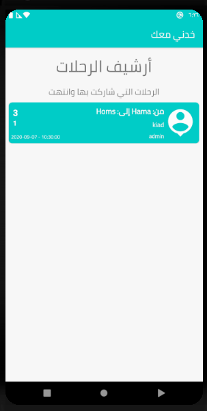
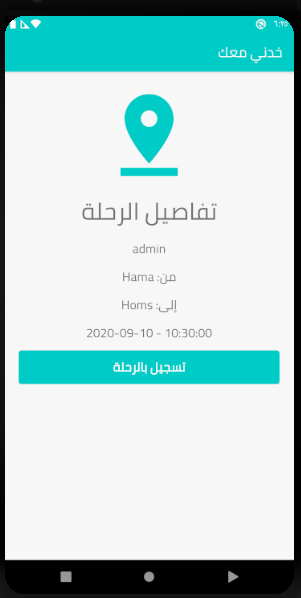
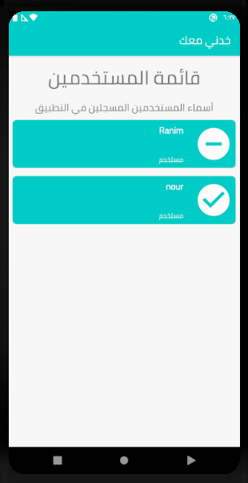
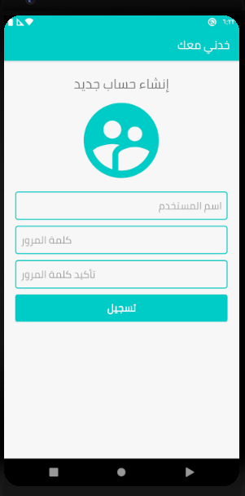

# KhedniMaak
Android App client communicates with PHP web service
  
 
 
 
 

KhedniMaak: an Arabic sentence means take me with you 
this app is used for both vehicle owners and passengers, when a passenger needs a lift to go somewhere he could access the app and see if theres any trip to the same destination and signup to it.
  

## run the APP
- first host the webAPI to your server, create a new DataBase using mysql, and import DataBase.sql to it.
- Set your DataBase credentials  to the file "config.php"
- Using AndroidStudio add your webAPI url to the file "values/strings.xml"
- enjoy

## Disclaimer
Yes the API server is stupid, it doesn't have any sense of security and authorization, because I built this server using pure PHP, it would be better to use frameworks like Laravel which I am currently using to build all my web apps and APIs. 
